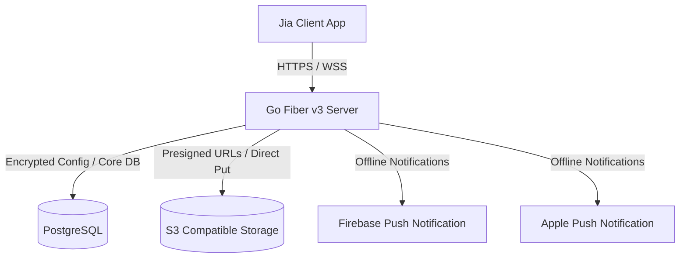

# Jia Messenger Server

Jia is a lightweight, self-hosted, end-to-end encrypted (E2EE) messaging platform. This repository contains the backend server application, written in Go using Fiber v3 and GORM/PostgreSQL.

## Key Features

- **End-to-End Encryption (E2EE)**: Complete support for X3DH (Extended Triple Diffie-Hellman) key exchange and Double Ratchet session setup. No plaintext message bodies or attachment encryption keys are ever saved on the server database.
- **Client-Side S3 Attachments**: Files are encrypted on the client before being uploaded to S3-compatible storage (like MinIO or AWS S3). The backend handles secure presigned URL generation and access control checks.
- **Dynamic Configuration Vault**: Server configurations (including credentials like S3 secrets and FCM/APNs keys) are stored encrypted in the database using AES-256-GCM (derived from a server master key) and can be updated at runtime.
- **Real-Time Synchronization**: A high-performance WebSocket hub syncing live delivery, edits, deletes, typing states, and reactions.
- **Offline Push Notifications**: Integration with Google FCM and Apple APNs to send wake-up triggers for offline devices.
- **Admin Management Console**: Endpoints to monitor stats, revoke/generate invite codes, configure global limits, and manage users.

---

## Architecture Overview



---

## Folder Structure

- `cmd/server/main.go` - Application entrypoint.
- `internal/config/` - Environment parser.
- `internal/database/` - Postgres connector.
- `internal/models/` - GORM database models.
- `internal/repositories/` - SQL access layers (users, messages, keys, settings, etc.).
- `internal/services/` - Core domain services (auth, E2E key exchange, push alerts, MinIO client).
- `internal/middleware/` - JWT auth guards, admin flags, first-run setup filters.
- `internal/handlers/` - HTTP controller handlers.
- `internal/dto/` - Clean Request/Response struct definitions.
- `internal/ws/` - WebSocket client connections and hub.

---

## Getting Started

### Prerequisites

- [Docker](https://www.docker.com/) and [Docker Compose](https://docs.docker.com/compose/)
- Go 1.25+ (if running bare-metal locally)

### Quickstart (Docker Compose)

1. Clone this repository and enter the directory.
2. Spin up the stack:
   ```bash
   docker-compose up --build -d
   ```
   This command starts:
   - PostgreSQL (port `5432`)
   - MinIO S3 Server (ports `9000` API, `9001` Web Console)
   - Jia Go Backend Server (port `3000`)

---

## First-Run Setup Wizard

When the server starts for the first time, it operates in **Setup Mode**. All core API calls are gated until the administrator completes the configuration.

Submit a `POST /api/setup` request:

```json
{
  "admin": {
    "username": "admin",
    "display_name": "Server Administrator",
    "email": "admin@example.com",
    "password": "your-secure-admin-password"
  },
  "server": {
    "name": "Jia Self-Hosted",
    "registration_mode": "invite"
  },
  "s3": {
    "endpoint": "minio:9000",
    "bucket": "jia-attachments",
    "access_key": "minioadmin",
    "secret_key": "minioadmin",
    "use_ssl": false
  }
}
```

This request:
1. Creates the root administrator account.
2. Saves S3 access parameters encrypted with `JIA_MASTER_KEY` in the database.
3. Automatically triggers S3 bucket provisioning.
4. Activates normal server routing.

---

## API Documentation Map

### Public / Unauthenticated
- `GET /api/setup/status` - Checks if setup is completed.
- `POST /api/setup` - Core configuration setup.
- `POST /api/auth/register` - Register new user (validated against InviteCodes if invite mode is enabled).
- `POST /api/auth/login` - Returns Access Token + Refresh Token.
- `POST /api/auth/refresh` - Rotate session token.
- `POST /api/auth/logout` - Invalidate refresh token session.

### Authenticated (Bearer JWT Required)
- `GET /api/ws` - Upgrade connection to WebSocket.
- `GET /api/users/me` | `PATCH /api/users/me` - Profile operations.
- `GET /api/users/search?q=query` - User directory search.
- `POST /api/keys/bundle` | `GET /api/keys/:userId` - E2E X3DH prekey management.
- `GET /api/conversations` | `POST /api/conversations` - DM/Group management.
- `GET /api/conversations/:id/messages` - Paginated chat history (returns ciphertext).
- `POST /api/conversations/:id/messages` - Send messages or upload attachments.
- `PATCH /api/messages/:id` | `DELETE /api/messages/:id` - Edit/delete messages.
- `POST /api/messages/:id/reactions` - Emoji reactions.
- `GET /api/attachments/:id/url` - Generate download presigned URL for encrypted media.
- `POST /api/push/subscribe` - Subscribe to offline APNs/FCM tokens.

### Administrative Control (Admin Token Required)
- `GET /api/admin/stats` - Server uptime, user counters, message volume.
- `GET /api/admin/settings` | `PATCH /api/admin/settings` - Configure server name, upload size limits, push details.
- `GET /api/admin/users` | `PATCH /api/admin/users/:id` - Manage user roles and delete accounts.
- `GET /api/admin/invites` | `POST /api/admin/invites` - Manage registration invite codes.

---

## Development & Testing

Run unit builds locally:
```bash
go build ./...
```

Run linter checks or go formatting:
```bash
go fmt ./...
go vet ./...
```
